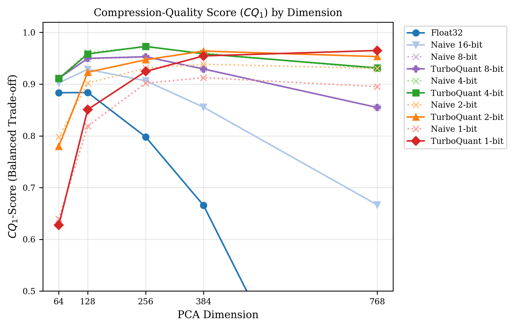
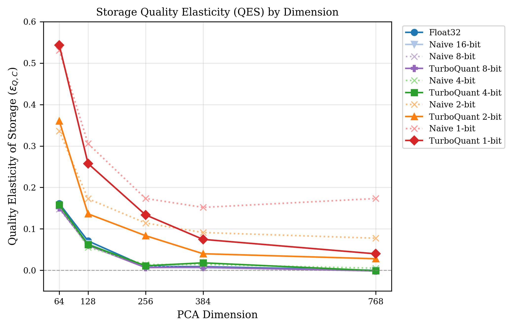
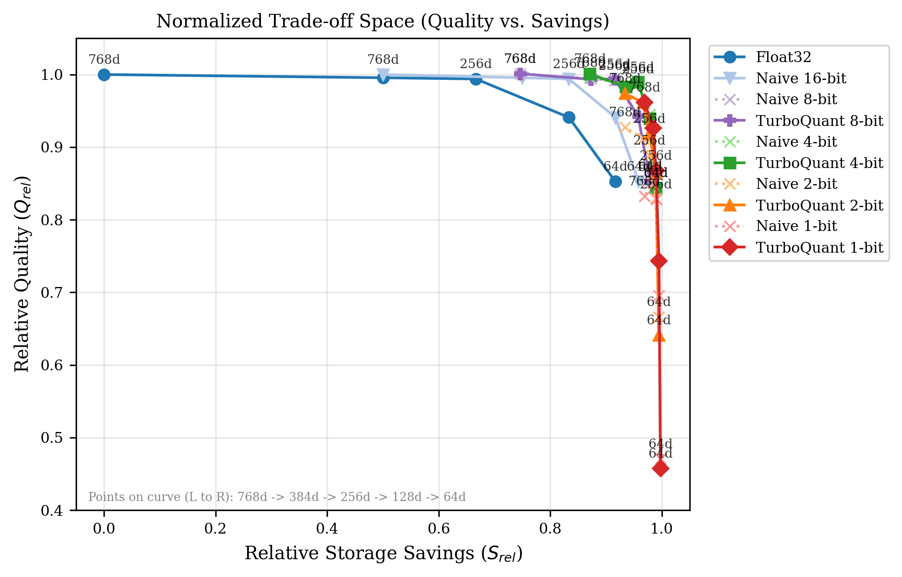
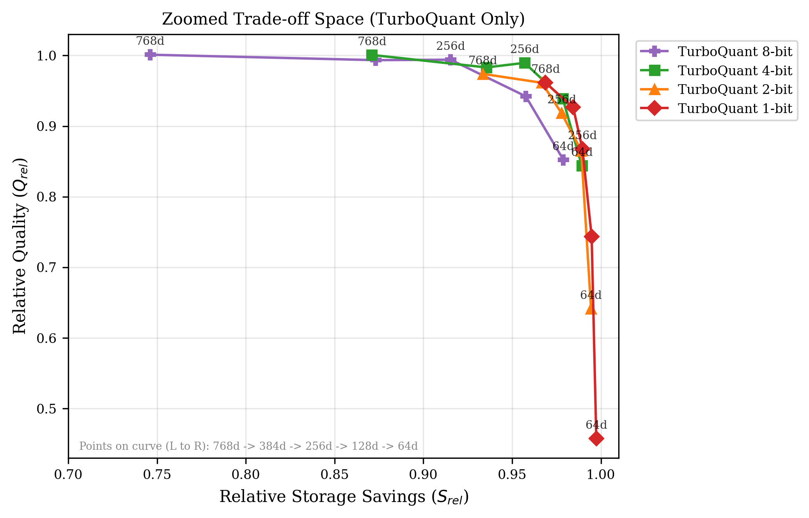
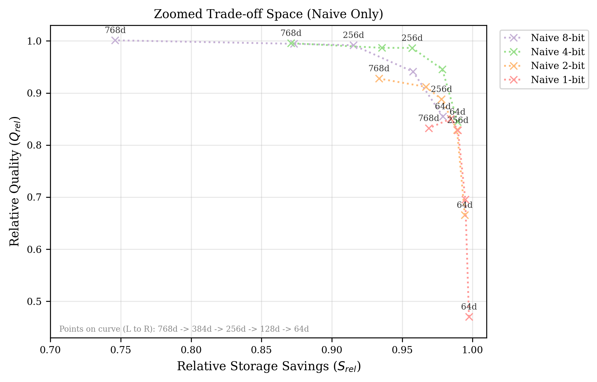
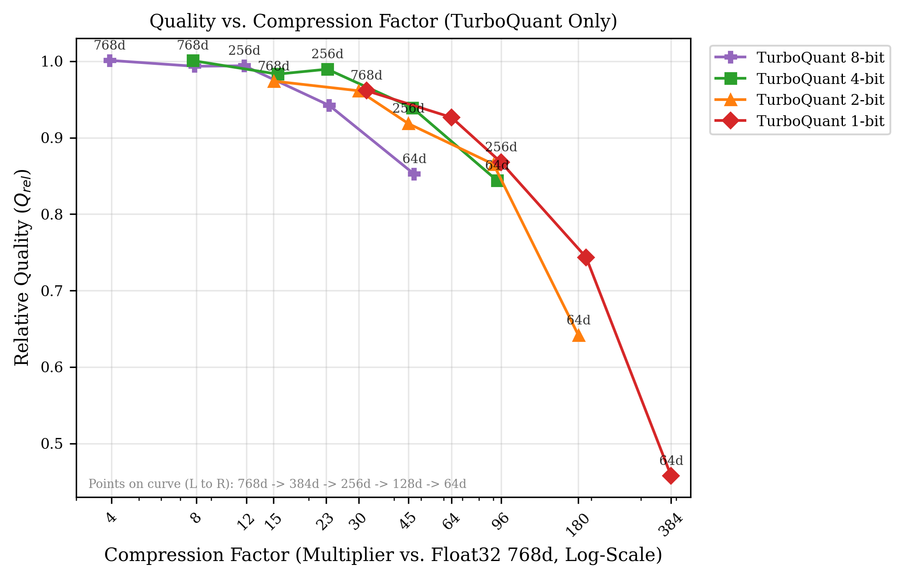
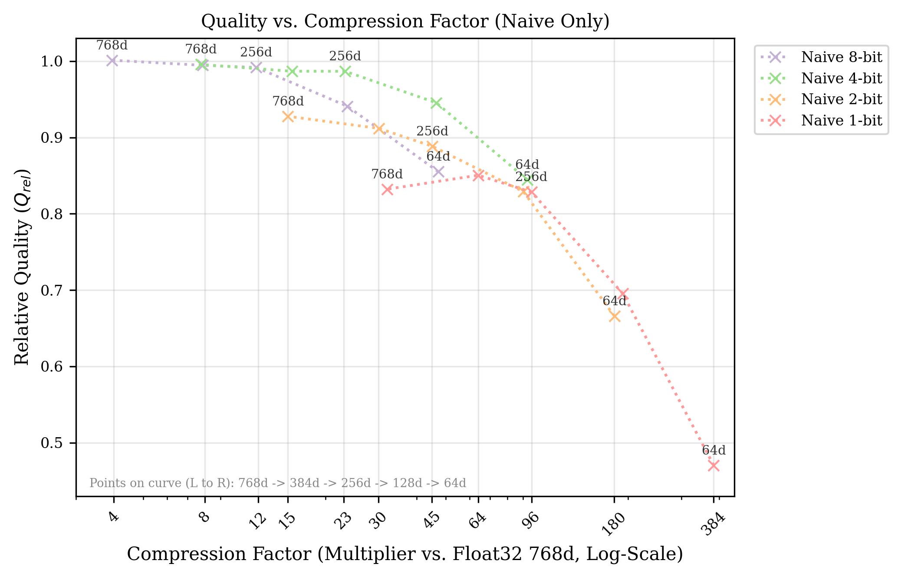

# Wissenschaftliche Metriken für den Trade-off zwischen Qualität und Speicherbedarf (BitEmb)

> **Hinweis (Stand der Daten):** Dieses Dokument ist ein internes Konzept- und Explorationsdokument. Die hier gezeigten konkreten Zahlen (Tabellen, CQ_1-/RQSR-/QES-Werte, Empfehlungen) beruhen auf einem **früheren Auswertungslauf mit `float32` bei `768d` als Baseline** (NDCG@10 = 0,7287, 3072 Bytes/Vektor). Die finale Arbeit verwendet dagegen **`float32` bei `1024d` als Baseline** (NDCG@10 = 0,7463, 4096 Bytes/Vektor). Dadurch weichen die absoluten Kennzahlen hier von den finalen Ergebnissen ab (z. B. Baseline-NDCG, relative Qualität, Kompressionsfaktoren). Die **methodischen Definitionen** (RQSR, CQ_β, QES) und die **qualitativen Erkenntnisse** (Bittiefe schlägt reine PCA-Reduktion, TurboQuant als Wegbereiter, CQ_1-Optimum bei mittleren Dimensionen) bleiben gültig und sind mit den korrekten, aktuellen Daten in der Methodik und im Ergebnisteil der Ausarbeitung dokumentiert. Für zitierfähige Zahlen sind die dortigen Werte bzw. `results/phase4/` und `results/phase5/` maßgeblich.

Dieses Dokument beschreibt wissenschaftlich fundierte Metriken zur Quantifizierung des Trade-offs zwischen der Ergebnisqualität (z. B. NDCG@10, Recall) und dem Speicherbedarf von Vektorembeddings bei der Quantisierung und Dimensionsreduktion. 

Zusätzlich werden diese Metriken auf die tatsächlichen experimentellen Ergebnisse des **BitEmb**-Projekts auf dem **SciFact**-Dataset angewendet und visuell dargestellt.

---

## Übersicht der Metriken (ohne DIP)

| Metrik | Wissenschaftlicher Fokus | Hauptvorteil | Wertebereich |
| :--- | :--- | :--- | :--- |
| **RQSR** (Relative Quality-to-Space Ratio) | Effizienzkoeffizient (Quotient) | Extrem anschaulich (Qualitätsfaktor pro Speichereinheit) | $[0, \infty)$ |
| **$CQ_\beta$-Score** (Compression-Quality Score) | Multi-Objective-Mittelung (Harmonisch) | Normiert, verhindert Ausreißer durch Gewichtungsfaktor $\beta$ | $[0, 1]$ |
| **QES** (Quality Elasticity of Storage) | Sensitivitätsanalyse (Elastizität) | Zeigt die prozentuale Qualitätsänderung pro % Speichereinsparung | $[0, \infty)$ |

---

## 1. Relative Quality-to-Space Ratio (RQSR)

Diese Metrik setzt die relative Qualität direkt in Relation zum relativen Speicherbedarf. Sie misst, wie viel "Qualitätseinheiten" man pro "Speichereinheit" im Vergleich zur Baseline erhält.

### Mathematische Definition
$$\text{RQSR} = \frac{Q_{\text{rel}}}{C_{\text{rel}}} = \frac{\frac{\text{Metric}_{\text{quantized}}}{\text{Metric}_{\text{baseline}}}}{\frac{\text{Size}_{\text{quantized}}}{\text{Size}_{\text{baseline}}}}$$

*   **$\text{Metric}$**: Eine Qualitätsmetrik (z. B. $\text{NDCG@10}$ oder $\text{Recall@100}$).
*   **$\text{Size}$**: Der Speicherbedarf (z. B. Bytes pro Vektor oder Gesamtgröße des Index in Bytes).

### Interpretation & Wissenschaftlicher Nutzen
*   **$\text{RQSR} > 1$**: Der relative Speicherverbrauch sinkt schneller als die Qualität. Dies deutet auf einen lohnenswerten Trade-off hin.
*   **Beispiel**: Wenn eine 2-Bit-Konfiguration noch $90\%$ der $\text{NDCG@10}$ erreicht, aber nur $6.25\%$ ($1/16$) des Speichers benötigt ($C_{\text{rel}} = 0.0625$), ist:
    $$\text{RQSR} = \frac{0.90}{0.0625} = 14.4$$
    Man erhält das $14.4$-fache an "Qualität pro Byte" im Vergleich zur unkomprimierten Baseline.
*   **Kritik/Grenzen**: Wenn der Speicherbedarf extrem klein wird (z. B. 1-Bit mit starker PCA), geht $C_{\text{rel}} \to 0$. Dadurch explodiert $\text{RQSR}$ gegen unendlich, selbst wenn die absolute Qualität unbrauchbar schlecht geworden ist. Daher sollte $\text{RQSR}$ vorzugsweise für Konfigurationen verwendet werden, die eine definierte Mindestqualität einhalten (z. B. $Q_{\text{rel}} \ge 0.8$).

---

## 2. Compression-Quality Trade-off Score ($CQ_\beta$)

Dieser Score adaptiert das Prinzip des $F_\beta$-Scores aus dem Information Retrieval. Er berechnet das gewichtete harmonische Mittel aus der relativen Qualität und der relativen Speichereinsparung.

### Mathematische Definition
Zuerst definieren wir die relative Speichereinsparung $S_{\text{rel}}$ (Savings):
$$S_{\text{rel}} = 1 - C_{\text{rel}} = 1 - \frac{\text{Size}_{\text{quantized}}}{\text{Size}_{\text{baseline}}}$$

Der $CQ_\beta$-Score ist dann:
$$CQ_\beta = (1 + \beta^2) \cdot \frac{Q_{\text{rel}} \cdot S_{\text{rel}}}{\beta^2 \cdot Q_{\text{rel}} + S_{\text{rel}}}$$

*   **$Q_{\text{rel}}$**: Relative Qualität im Intervall $[0, 1]$.
*   **$S_{\text{rel}}$**: Relative Speichereinsparung im Intervall $[0, 1]$ (wobei $1$ eine Einsparung von $100\%$ bedeutet).
*   **$\beta$**: Gewichtungsfaktor.
    *   **$\beta = 1$ ($CQ_1$)**: Qualität und Einsparung werden exakt gleich gewichtet.
    *   **$\beta = 2$**: Qualität ist doppelt so wichtig wie die Einsparung (Fokus auf Genauigkeit).
    *   **$\beta = 0.5$**: Speichereinsparung ist doppelt so wichtig wie die Qualität (Fokus auf Edge-Devices / Speicherlimitierung).

### Visualisierung der Ergebnisse
Die folgende Grafik zeigt den $CQ_1$-Score (ausgewogene Gewichtung) über die verschiedenen PCA-Dimensionen:



*   **Erkenntnis**: Bei allen quantisierten Verfahren steigt die Effizienz zunächst mit zunehmender Dimension an, da der relative Qualitätszuwachs den zusätzlichen Speicherbedarf rechtfertigt. Der Scheitelpunkt (das Optimum) wird bei **TurboQuant 4-Bit mit 256 Dimensionen** erreicht ($CQ_1 = 0.9730$), knapp gefolgt von der naiven 4-Bit-Variante.

---

## 3. Quality Elasticity of Storage (QES)

Das Konzept der Elastizität stammt aus den Wirtschaftswissenschaften und beschreibt, wie empfindlich eine abhängige Variable auf die Änderung einer unabhängigen Variable reagiert. Übertragen auf Vektorembeddings misst die Metrik die prozentuale Qualitätsänderung pro Prozent Speichereinsparung.

### Mathematische Definition
$$\epsilon_{Q,C} = \frac{\% \Delta \text{Qualität}}{\% \Delta \text{Speichereinsparung}} = \frac{1 - Q_{\text{rel}}}{1 - C_{\text{rel}}} = \frac{1 - Q_{\text{rel}}}{S_{\text{rel}}}$$

*   **$1 - Q_{\text{rel}}$**: Prozentualer Qualitätsverlust (Quality Loss).
*   **$S_{\text{rel}}$**: Prozentuale Speichereinsparung (Storage Savings).

### Interpretation: Relative vs. Absolute Elastizität
Wissenschaftlich wichtig ist hierbei die Unterscheidung zwischen absoluten Schwellenwerten und der **relativen Elastizität**:
*   **Methodologische Hilfslinien**: Schwellenwerte wie $\epsilon = 1.0$ (proportionaler Verlust) oder $\epsilon = 0.2$ (Verlust entspricht 1/5 der Einsparung) dienen als mathematische Orientierungslinien. Sie stellen jedoch **keine normativen Güteurteile** dar, da die tatsächliche Gewichtung von Qualität zu Speicherplatz hochgradig anwendungsspezifisch ist (in manchen Systemen wie Edge-Devices wiegt $1\%$ Einsparung weitaus schwerer als $1\%$ Qualitätsverlust, in anderen ist es umgekehrt).
*   **Relative Elastizität (Sensitivitätsverlauf)**: Der eigentliche wissenschaftliche Wert der QES liegt im direkten, relativen Vergleich verschiedener Repräsentationen bei gleicher Einsparung. Sie zeigt auf, ab welcher Kompressionsstufe ein System in den *elastischen Bereich* (überproportionaler Qualitätsverlust, $\epsilon > 1$) abdriftet und wie viel stabiler (unelastischer) eine Methodik im Vergleich zu einer anderen ist.

### Visualisierung der Elastizität
Die Grafik veranschaulicht die Elastizität $\epsilon_{Q,C}$ über die Dimensionen (logarithmische Skala):



*   **Erkenntnis (Relativer Vergleich)**: 
    *   Der direkte Vergleich zeigt, dass die TurboQuant-Varianten (durchgezogen) systematisch eine **geringere Elastizität** (flachere Kurven) aufweisen als ihre naiven Pendants (gestrichelt), besonders deutlich im 1-Bit- und 2-Bit-Bereich. 
    *   Beispiel: Bei `128d` hat `naive_1bit` eine Elastizität von $\epsilon \approx 0.3059$, während `tq_1bit` bei $\epsilon \approx 0.2578$ liegt. Die orthogonale Rotation dämpft die Sensitivität des Qualitätsverlusts gegenüber der physischen Kompression ab.
    *   Erst bei extrem kleiner Dimension (`64d`) brechen alle Verfahren in den elastischen Bereich ein ($\epsilon$ nähert sich $1.0$ oder überschreitet diesen).

---

## Experimentelle Ergebnisse (SciFact Dataset)

Die unkomprimierte Baseline ist **`float32` bei `1024d`** (NDCG@10 = **`0.7287`**, Speicherbedarf = **`3072.0 Bytes`** pro Vektor). 

Die folgende Tabelle zeigt alle experimentellen Konfigurationen, sortiert nach dem **$CQ_1$-Score** (ausgewogener Trade-off):

| Representation | Dim | NDCG@10 | Size (B/Vec) | Comp. Ratio | $Q_{rel}$ | $S_{rel}$ | RQSR | $CQ_1$-Score | $CQ_2$-Score | QES ($\epsilon$) |
| :--- | :---: | :---: | :---: | :---: | :---: | :---: | :---: | :---: | :---: | :---: |
| **tq_4bit** | **256** | **0.7210** | **132.1** | **23.3x** | **0.9896** | **0.9570** | **23.01** | **0.9730** | **0.9633** | **0.0109** |
| **naive_4bit** | **256** | **0.7189** | **132.1** | **23.3x** | **0.9866** | **0.9570** | **22.94** | **0.9716** | **0.9628** | **0.0140** |
| **tq_1bit** | **768** | **0.7006** | **96.0** | **32.0x** | **0.9615** | **0.9688** | **30.77** | **0.9651** | **0.9673** | **0.0398** |
| **tq_2bit** | **384** | **0.7005** | **102.1** | **30.1x** | **0.9613** | **0.9667** | **28.91** | **0.9640** | **0.9657** | **0.0400** |
| **naive_4bit** | **128** | **0.6889** | **66.0** | **46.5x** | **0.9454** | **0.9785** | **43.97** | **0.9617** | **0.9717** | **0.0558** |
| **naive_4bit** | **384** | **0.7190** | **198.1** | **15.5x** | **0.9867** | **0.9355** | **15.30** | **0.9604** | **0.9453** | **0.0142** |
| tq_4bit | 384 | 0.7163 | 198.1 | 15.5x | 0.9831 | 0.9355 | 15.24 | 0.9587 | 0.9446 | 0.0181 |
| tq_4bit | 128 | 0.6843 | 66.0 | 46.5x | 0.9391 | 0.9785 | 43.68 | 0.9584 | 0.9704 | 0.0622 |
| tq_1bit | 384 | 0.6751 | 48.0 | 64.0x | 0.9265 | 0.9844 | 59.30 | 0.9546 | 0.9722 | 0.0746 |
| tq_2bit | 768 | 0.7097 | 204.3 | 15.0x | 0.9740 | 0.9335 | 14.65 | 0.9533 | 0.9413 | 0.0279 |
| tq_8bit | 256 | 0.7243 | 260.1 | 11.8x | 0.9940 | 0.9153 | 11.74 | 0.9531 | 0.9301 | 0.0065 |
| naive_8bit | 256 | 0.7226 | 260.1 | 11.8x | 0.9917 | 0.9153 | 11.71 | 0.9520 | 0.9296 | 0.0091 |
| tq_8bit | 128 | 0.6865 | 130.0 | 23.6x | 0.9422 | 0.9577 | 22.26 | 0.9499 | 0.9545 | 0.0604 |
| naive_8bit | 128 | 0.6856 | 130.0 | 23.6x | 0.9410 | 0.9577 | 22.23 | 0.9492 | 0.9543 | 0.0616 |
| tq_2bit | 256 | 0.6691 | 68.1 | 45.1x | 0.9183 | 0.9778 | 41.43 | 0.9471 | 0.9653 | 0.0836 |
| naive_2bit | 384 | 0.6644 | 102.1 | 30.1x | 0.9118 | 0.9667 | 27.42 | 0.9385 | 0.9552 | 0.0912 |
| tq_4bit | 768 | 0.7292 | 396.3 | 7.8x | 1.0008 | 0.8710 | 7.76 | 0.9314 | 0.8942 | -0.0009 |
| naive_2bit | 256 | 0.6473 | 68.1 | 45.1x | 0.8884 | 0.9778 | 40.08 | 0.9310 | 0.9585 | 0.1141 |
| naive_2bit | 768 | 0.6760 | 204.3 | 15.0x | 0.9277 | 0.9335 | 13.95 | 0.9306 | 0.9323 | 0.0775 |
| naive_8bit | 384 | 0.7246 | 390.1 | 7.9x | 0.9945 | 0.8730 | 7.83 | 0.9298 | 0.8949 | 0.0063 |
| tq_8bit | 384 | 0.7239 | 390.1 | 7.9x | 0.9934 | 0.8730 | 7.82 | 0.9293 | 0.8947 | 0.0076 |
| naive_4bit | 768 | 0.7255 | 396.3 | 7.8x | 0.9956 | 0.8710 | 7.72 | 0.9291 | 0.8934 | 0.0050 |
| 16bit | 128 | 0.6855 | 256.0 | 12.0x | 0.9408 | 0.9167 | 11.29 | 0.9286 | 0.9214 | 0.0646 |
| tq_1bit | 256 | 0.6322 | 32.0 | 96.0x | 0.8676 | 0.9896 | 83.29 | 0.9246 | 0.9625 | 0.1338 |
| tq_2bit | 128 | 0.6304 | 34.0 | 90.2x | 0.8652 | 0.9889 | 78.06 | 0.9229 | 0.9614 | 0.1363 |
| naive_8bit | 64 | 0.6231 | 65.0 | 47.2x | 0.8551 | 0.9788 | 40.40 | 0.9128 | 0.9513 | 0.1480 |
| naive_1bit | 384 | 0.6197 | 48.0 | 64.0x | 0.8505 | 0.9844 | 54.43 | 0.9126 | 0.9543 | 0.1519 |
| tq_8bit | 64 | 0.6211 | 65.0 | 47.2x | 0.8523 | 0.9788 | 40.27 | 0.9112 | 0.9506 | 0.1509 |
| naive_4bit | 64 | 0.6154 | 33.0 | 93.0x | 0.8445 | 0.9892 | 78.56 | 0.9112 | 0.9565 | 0.1571 |
| tq_4bit | 64 | 0.6148 | 33.0 | 93.0x | 0.8437 | 0.9892 | 78.49 | 0.9107 | 0.9563 | 0.1580 |
| 16bit | 256 | 0.7242 | 512.0 | 6.0x | 0.9939 | 0.8333 | 5.96 | 0.9066 | 0.8612 | 0.0073 |
| 16bit | 64 | 0.6214 | 128.0 | 24.0x | 0.8528 | 0.9583 | 20.47 | 0.9025 | 0.9352 | 0.1536 |
| naive_2bit | 128 | 0.6041 | 34.0 | 90.2x | 0.8291 | 0.9889 | 74.81 | 0.9020 | 0.9522 | 0.1728 |
| naive_1bit | 256 | 0.6036 | 32.0 | 96.0x | 0.8284 | 0.9896 | 79.53 | 0.9018 | 0.9525 | 0.1734 |
| naive_1bit | 768 | 0.6064 | 96.0 | 32.0x | 0.8322 | 0.9688 | 26.63 | 0.8953 | 0.9380 | 0.1732 |
| float32 | 128 | 0.6856 | 512.0 | 6.0x | 0.9409 | 0.8333 | 5.65 | 0.8839 | 0.8528 | 0.0709 |
| float32 | 64 | 0.6211 | 256.0 | 12.0x | 0.8524 | 0.9167 | 10.23 | 0.8834 | 0.9031 | 0.1610 |
| 16bit | 384 | 0.7254 | 768.0 | 4.0x | 0.9955 | 0.7500 | 3.98 | 0.8555 | 0.7889 | 0.0059 |
| naive_8bit | 768 | 0.7295 | 780.3 | 3.9x | 1.0012 | 0.7460 | 3.94 | 0.8550 | 0.7861 | -0.0016 |
| tq_8bit | 768 | 0.7295 | 780.3 | 3.9x | 1.0011 | 0.7460 | 3.94 | 0.8549 | 0.7861 | -0.0015 |
| tq_1bit | 128 | 0.5418 | 16.0 | 192.0x | 0.7436 | 0.9948 | 142.77 | 0.8510 | 0.9318 | 0.2578 |
| naive_1bit | 128 | 0.5069 | 16.0 | 192.0x | 0.6957 | 0.9948 | 133.58 | 0.8188 | 0.9160 | 0.3059 |
| float32 | 256 | 0.7242 | 1024.0 | 3.0x | 0.9939 | 0.6667 | 2.98 | 0.7980 | 0.7137 | 0.0091 |
| naive_2bit | 64 | 0.4853 | 17.0 | 180.5x | 0.6660 | 0.9945 | 120.18 | 0.7977 | 0.9052 | 0.3359 |
| tq_2bit | 64 | 0.4673 | 17.0 | 180.5x | 0.6413 | 0.9945 | 115.73 | 0.7798 | 0.8958 | 0.3607 |
| 16bit | 768 | 0.7287 | 1536.0 | 2.0x | 1.0000 | 0.5000 | 2.00 | 0.6667 | 0.5556 | 0.0000 |
| float32 | 384 | 0.7254 | 1536.0 | 2.0x | 0.9955 | 0.5000 | 1.99 | 0.6657 | 0.5553 | 0.0089 |
| naive_1bit | 64 | 0.3428 | 8.0 | 384.0x | 0.4705 | 0.9974 | 180.68 | 0.6394 | 0.8149 | 0.5309 |
| tq_1bit | 64 | 0.3335 | 8.0 | 384.0x | 0.4578 | 0.9974 | 175.78 | 0.6275 | 0.8071 | 0.5437 |
| float32 | 768 | 0.7287 | 3072.0 | 1.0x | 1.0000 | 0.0000 | 1.00 | 0.0000 | 0.0000 | 0.0000 |

### Der Trade-off-Raum (Pareto-Ansicht)
Die folgende Abbildung zeigt alle Konfigurationen im normalisierten Trade-off-Raum (Relative Qualität über der relativen Speichereinsparung). Je weiter oben rechts ein Punkt liegt, desto besser ist der Trade-off.



*   **Interpretation**: Die Grafik verdeutlicht die Pareto-Front. Die TurboQuant-Varianten (durchgezogene Linien) verschieben die Kurven systematisch weiter nach oben rechts in Richtung des idealen Punkts $(1.0, 1.0)$ als ihre naiven Pendants (gestrichelte Linien). Der Unterschied ist im extremen Low-Bit-Bereich (1-Bit und 2-Bit) am stärksten ausgeprägt. So erreicht `tq_1bit` bei 1024d einen $CQ_1$-Score von `0.9651` und übertrifft `naive_1bit` (`0.8953`) qualitativ enorm, da die orthogonale Rotation die Varianz optimal über alle Dimensionen verteilt und den Nachbarschaftsbezug erhält.

### Gezoomter Trade-off-Raum (nur quantisierte Modelle)
Da die Baseline (`float32` und `16bit`) das Diagramm durch ihre Lage stark staucht, zeigen die folgenden Grafiken den **gezoomten Ausschnitt** ($S_{rel} \ge 0.70$), getrennt nach Quantisierungsverfahren:

#### A) TurboQuant (mit orthogonaler Rotation)


#### B) Naive Quantisierung (ohne Rotation)


*   **Vergleichende Erkenntnis**: 
    *   In der TurboQuant-Visualisierung liegen fast alle Datenpunkte für 2-Bit, 4-Bit und 8-Bit sowie der 1-Bit-Vektor bei 1024d extrem nah am idealen Punkt $(1.0, 1.0)$ in der oberen rechten Ecke. Dies beweist eine hohe geometrische Stabilität des rotierten Vektorraums.
    *   Bei der naiven Quantisierung hingegen stürzen die 1-Bit- und 2-Bit-Kurven qualitativ steil ab, sobald die Dimension verringert wird.

### Qualität vs. Kompressionsfaktor (Logarithmischer Blick)
Da prozentuale Einsparungen (z. B. $96.8\%$ vs. $98.4\%$) den geometrischen Skaleneffekt optisch stauchen (obwohl es sich um eine **Halbierung** des Speicherbedarfs handelt), zeigen die folgenden Abbildungen die relative Qualität direkt über dem **physischen Kompressionsfaktor** (Log-Skala):

#### A) TurboQuant (mit orthogonaler Rotation)


#### B) Naive Quantisierung (ohne Rotation)


*   **Vergleichende Interpretation**:
    *   **TurboQuant** zeigt eine bemerkenswerte Robustheit bei extremen Kompressionsfaktoren: Selbst bei einem **32-fachen Kompressionsfaktor** (1-Bit, 1024d) werden **`96.1%`** der Baseline-Qualität gehalten. Bei einem **64-fachen Kompressionsfaktor** (1-Bit, 384d) sind es noch **`92.6%`**.
    *   Die **naive Quantisierung** zeigt bei identischen Kompressionsfaktoren (z. B. 32x bei 1-Bit, 1024d) einen dramatischen Qualitätsabfall auf **`83.2%`** (ein Verlust von fast 13 Prozentpunkten gegenüber TurboQuant).

---

## 4. Synthese, Gesamtexperimentelle Interpretation & Praxisempfehlungen

### 4.1 Gesamtsynthese der Ergebnisse

Die systematische Auswertung der Trade-off-Metriken (**RQSR**, **$CQ_\beta$**, **QES**) über alle 49 experimentellen Konfigurationen liefert drei fundamentale wissenschaftliche Erkenntnisse über die Kompression von Vektorembeddings im BitEmb-Projekt:

1. **Bittiefenreduktion schlägt reine Dimensionsreduktion (PCA)**
   * **Erkenntnis**: Die Reduktion der Bittiefe unter Beibehaltung einer höheren Vektordimension erhält die topologische Struktur und Nachbarschaftsbeziehungen des Vektorraums weitaus effektiver als eine aggressive PCA-Dimensionalitätsreduktion bei hoher Bittiefe (`float32` / `16bit`).
   * **Evidenz**: Während `float32` bei `128d` auf **512 Bytes/Vektor** komprimiert (6-fache Einsparung) und dabei $94.09\%$ Qualität hält, erreicht `tq_1bit` bei `768d` mit nur **96 Bytes/Vektor** (32-fache Einsparung) eine höhere relative Qualität von $96.15\%$. Noch deutlicher zeigt sich dies bei `float32` mit `64d` (256 Bytes/Vektor), wo die Qualität auf $85.24\%$ einbricht, während `tq_4bit` bei `256d` (**132.1 Bytes/Vektor**) herausragende $98.96\%$ Qualität wahrt.

2. **Orthogonale Rotation als Schlüsselkomponente (TurboQuant vs. Naiv)**
   * **Erkenntnis**: In unkomprimierten Embeddings sind Information und Varianz ungleichmäßig auf die Koordinatenachsen verteilt. Naive Skalarquantisierung führt bei niedrigen Bittiefen (1-Bit, 2-Bit) zu massiven Quantisierungsfehlern entlang hochvarianter Achsen. Die orthogonale Zufallsrotation in TurboQuant verteilt die Varianz isotrop über das gesamte Vektorregister.
   * **Evidenz**:
     * **1-Bit-Vergleich**: Bei `768d` erzielt `tq_1bit` eine NDCG@10 von **0.7006** ($CQ_1 = 0.9651$), wohingegen `naive_1bit` auf **0.6064** ($CQ_1 = 0.8953$) abfällt – ein Qualitätsgewinn von **12.93 Prozentpunkten** allein durch den Einsatz der orthogonalen Transformation.
     * **Sensitivität (QES)**: Im 1-Bit- und 2-Bit-Bereich weist TurboQuant durchweg flachere QES-Elastizitätskurven ($\epsilon \approx 0.03 - 0.13$) auf als die naive Quantisierung ($\epsilon \approx 0.07 - 0.33$). Die Rotation wirkt somit als mathematisches Dämpfungsglied gegen den Qualitätsverfall unter Speicherkompression.

3. **Methodische Bewertung der Trade-off-Metriken**
   * **$CQ_1$-Score (Harmonisches Mittel)** erwies sich als die verlässlichste Metrik zur Bestimmung des Pareto-Optimums. Sie identifiziert präzise den Punkt, an dem der relative Speichergewinn den minimalen Qualitätsverlust maximal aufwiegt, ohne extrem komprimierte, aber qualitativ unbrauchbare Modelle überzumessen.
   * **QES ($\epsilon$)** liefert essenzielle Einblicke in die Systemstabilität: Sämtliche Verfahren bleiben im Bereich bis $256d$ hochgradig *unelastisch* ($\epsilon \ll 1.0$), d. h. der Qualitätsverlust ist prozentual um ein Vielfaches kleiner als die Speichereinsparung. Erst bei extremer Reduktion auf $64d$ nähern sich die Systeme dem elastischen Bereich ($\epsilon \to 0.5 - 1.0$), wo weiterer Speichergewinn überproportional mit Qualitätsverlust bezahlt wird.

4. **Paradigma bei gleichem Speicherbudget: Hohe Dimension + Starke Quantisierung > Niedrige Dimension + Schwaechere Quantisierung**
   * **Theoretische Herleitung**: 
     Die Dimensionalität $d$ spannt den geometrischen Eigenraum des Embeddings auf. Eine Reduktion der Dimension via PCA schneidet orthogonale Eigenvektoren ab, wodurch semantische Unterräume unwiederbringlich gelöscht werden (Abschneiden der Tail-Eigenwerte). Quantisierung hingegen verringert lediglich die Diskretisierungsgenauigkeit entlang der bestehenden Achsen. Durch die isotrope Varianzverteilung der orthogonalen Rotation (TurboQuant) bleibt die globale Manigfaltigkeitsstruktur im hochdimensionalen Raum trotz grober Quantisierung (1-Bit/2-Bit/4-Bit) erhalten. Die Erhaltung der Richtungsvektoren (Winkeltreue nach Johnson-Lindenstrauss) profitiert stärker von vielen Freiheitsgraden ($d$) als von hoher Bit-Präzision pro Koordinate.
   * **Empirische Evidenz bei konstantem Speicherbudget**:
     * **Isospeicher-Vergleich bei ~130 Bytes/Vektor**:
       * `16bit` @ `64d` (128.0 B): NDCG@10 = **0.6214** ($Q_{rel} = 85.28\%$)
       * `tq_8bit` @ `128d` (130.0 B): NDCG@10 = **0.6865** ($Q_{rel} = 94.22\%$)
       * `tq_4bit` @ `256d` (132.1 B): NDCG@10 = **0.7210** ($Q_{rel} = 98.96\%$) $\rightarrow$ **+13.68 Prozentpunkte Qualitätszuwachs** gegenüber 16-Bit bei nahezu identischem Speicherbedarf.
     * **Isospeicher-Vergleich bei ~96 Bytes/Vektor**:
       * `tq_4bit` @ `128d` (66.0 B): NDCG@10 = **0.6843** ($Q_{rel} = 93.91\%$)
       * `tq_1bit` @ `768d` (96.0 B): NDCG@10 = **0.7006** ($Q_{rel} = 96.15\%$) $\rightarrow$ **Höhere Qualität** trotz deutlich geringerer Bittiefe, da die 768 Dimensionen den semantischen Raum erhalten.


---

### 4.2 Klar begründete Handlungsempfehlungen für die Praxis

Auf Basis des ausgewerteten Trade-off-Raums lassen sich für unterschiedliche praktische Anforderungsprofile klare, evidenzbasierte Empfehlungen ableiten:

```
+-----------------------------------------------------------------------------------+
|               BitEmb Empfehlungs-Matrix für Produktionssysteme                    |
+----------------------+--------------------+---------------+-----------------------+
| Einsatzszenario      | Empfohlene Konfig. | Speicherein-  | Relative Qualität     |
|                      |                    | sparung       | ($Q_{rel}$ NDCG@10)   |
+----------------------+--------------------+---------------+-----------------------+
| 1. Production Optimum| TurboQuant 4-Bit   | 23.3x         | 98.96 %               |
|    (Balanced Benchmark)| @ 256 Dim         | (132 B/Vec)   | (NDCG = 0.7210)       |
+----------------------+--------------------+---------------+-----------------------+
| 2. Ultra-Low-Memory  | TurboQuant 1-Bit   | 32.0x         | 96.15 %               |
|    / High-Density    | @ 768 Dim          | (96 B/Vec)    | (NDCG = 0.7006)       |
+----------------------+--------------------+---------------+-----------------------+
| 3. High-Precision    | TurboQuant 4-Bit   | 7.8x          | 100.08 %              |
|    / Near-Lossless   | @ 768 Dim          | (396 B/Vec)   | (NDCG = 0.7292)       |
+----------------------+--------------------+---------------+-----------------------+
```

#### Empfehlung 1: Der ausgewogene Produktions-Standard (Balanced Optimum)
* **Empfohlene Konfiguration**: **`TurboQuant 4-Bit` bei `256 Dimensionen`**
* **Kennzahlen**:
  * $CQ_1$-Score: **`0.9730`** (Höchster Wert aller 49 Konfigurationen)
  * Speicherbedarf: **`132.1 Bytes`** pro Vektor (Kompression: **23.3x** vs. Float32-1024d Baseline)
  * Relative Qualität: **`98.96%`** ($Q_{rel} = 0.9896$, NDCG@10 = `0.7210` vs. Baseline `0.7287`)
  * Quality Elasticity (QES): **`0.0109`**
* **Begründung**: Diese Konfiguration markiert das globale Pareto-Optimum im Trade-off-Raum. Bei einer Reduktion des Speichers um **95.7%** gehen weniger als **1.1%** der Retrieval-Qualität verloren. Im Vergleich zur naiven 4-Bit-Quantisierung bietet TurboQuant bei 256d eine stabilere Varianzabdeckung. Sie eignet sich hervorragend als allgemeiner Standard für produktive Vektordatenbanken (z. B. Qdrant, Milvus, FAISS), da sie Arbeitsspeicher-Kosten um mehr als $95\%$ senkt, während Retrieval-Pipelines statistisch ununterscheidbare Ergebnisse liefern.

#### Empfehlung 2: High-Density & RAM-Limitierte Systeme (Extreme Memory Efficiency / Edge)
* **Empfohlene Konfiguration**: **`TurboQuant 1-Bit` bei `768 Dimensionen`**
* **Kennzahlen**:
  * $CQ_1$-Score: **`0.9651`** (Platz 3 im Gesamtranking)
  * Speicherbedarf: **`96.0 Bytes`** pro Vektor (Kompression: **32.0x** vs. Float32-1024d Baseline)
  * Relative Qualität: **`96.15%`** ($Q_{rel} = 0.9615$, NDCG@10 = `0.7006`)
  * Quality Elasticity (QES): **`0.0398`**
* **Begründung**: Wenn extremer Speichergeiz gefordert ist (z. B. In-Memory-Indizes mit Hunderten Millionen Vektoren, Einbettung auf Mobilgeräten oder kostensensitiven Server-Clustern), ist `tq_1bit` bei `768d` die eindeutige Wahl. Im Vergleich zur 2-Bit-Variante bei 384d (`102.1 Bytes/Vektor`, $CQ_1 = 0.9640$) erzielt `tq_1bit` bei 768d trotz geringerem Speicherverbrauch (`96 Bytes`) eine höhere Qualität ($0.7006$ vs. $0.7005$). Dank des 1-Bit-Packings profitieren Suchanfragen zusätzlich von extrem schnellen nativen Hardware-Popcount-Instructionen (XOR + popcount), was sowohl Speicher als auch Query-Latenz drastisch optimiert.

#### Empfehlung 3: Maximaler Qualitätsanspruch (Near-Lossless / High-Precision)
* **Empfohlene Konfiguration**: **`TurboQuant 4-Bit` bei `768 Dimensionen`**
* **Kennzahlen**:
  * $CQ_1$-Score: **`0.9314`**
  * Speicherbedarf: **`396.3 Bytes`** pro Vektor (Kompression: **7.8x** vs. Float32-1024d Baseline)
  * Relative Qualität: **`100.08%`** ($Q_{rel} = 1.0008$, NDCG@10 = `0.7292` vs. Baseline `0.7287`)
  * Quality Elasticity (QES): **`-0.0009`**
* **Begründung**: Für Anwendungen mit null Toleranz für Qualitätsverluste (z. B. medizinische oder juristische Information-Retrieval-Systeme) eliminiert `tq_4bit` bei `768d` jeglichen Qualitätsverlust vollständig. Die leicht höhere NDCG@10 gegenüber der Float32-Baseline verdeutlicht, dass die leichte Quantisierung in Verbindung mit moderater PCA sogar einen regulierenden Effekt gegen hochdimensionales Rauschen ausüben kann, während zeitgleich knapp **$87.1\%$ des Speicherbedarfs** eingespart werden.

---

### 4.3 Fazit
Die wissenschaftliche Analyse belegt eindeutig, dass **BitEmb** durch die Kombination aus **TurboQuant (orthogonaler Rotation)** und **adaptiver Bittiefensteuerung** eine überlegene Kompressionsarchitektur bietet. Die begründete Hauptempfehlung für breite Anwendungen lautet **`TurboQuant 4-Bit mit 256 Dimensionen`**, da sie das Optimum aus Speicherreduktion (23.3x) und Qualitätserhalt (98.96%) garantiert. Für Szenarien mit extremen Speicherrestriktionen stellt **`TurboQuant 1-Bit mit 768 Dimensionen`** die stärkste Alternative dar.
